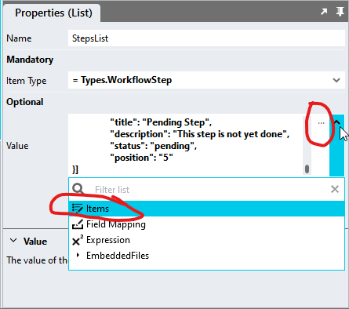
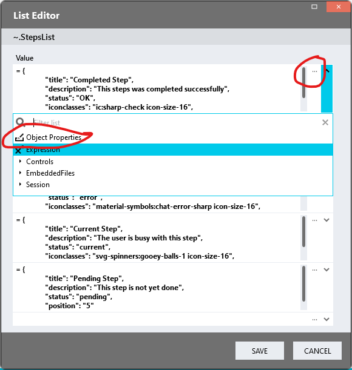
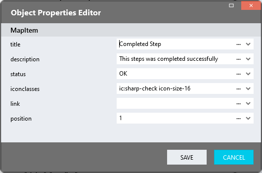

# WorkflowSteps

A module you can use to show workflow steps

https://github.com/stadium-software/workflow-steps/assets/2085324/0fa1bae8-8bfa-487f-9b67-3d43e8428050

## Version 
1.0 - initial

# Setup

## Dependency
In order to display icons in the workflow, the [Icons Module](https://github.com/stadium-software/icons) must be implemented in the application. There is no need to call this script as it will be called by the "WorkflowSteps" script below if icons are specified. The "Icons" Global Script and CSS files must, however, exist in the GlobalScripts and EnbeddedFiles folders as described in the [Icons](https://github.com/stadium-software/icons) repo

## Application Setup
1. Check the *Enable Style Sheet* checkbox in the application properties

## Type Setup
1. Create a new Type and call it "WorkflowStep"
2. Add the two properties below to the type
   1. title (Any)
   2. description (Any)
   3. status (Any)
   4. iconclasses (Any)
   5. link (Any)
   6. position (Any)


## Global Script Setup
1. Create a Global Script called "WorkflowSteps"
2. Add the input parameters below to the Global Script
   1. ContainerClass
   2. Steps
3. Drag a *JavaScript* action into the script
4. Add the Javascript below into the JavaScript code property
```javascript
/* Stadium Script Version 1.0 */
let arrSteps = ~.Parameters.Input.Steps;
let containerClassName = ~.Parameters.Input.ContainerClass;
let containerClass = "." + containerClassName;
if (!containerClass) { 
    console.error("A value for the parameter 'ContainerClass' must be provided");
    return false;
}
let container = document.querySelectorAll(containerClass);
if (container.length == 0 || container.length > 1) {
    console.error("The class '" + containerClassName + "' is not assigned to any or it is assigned to multiple workflow containers.");
    return false;
} else { 
    container = container[0];
}
container.classList.add("workflow-steps-container");
let callIcons = false;
let isHorizontal = container.classList.contains("workflow-horizontal");

const sortMe = (arr, key) => arr.sort((a, b) => (a[key] > b[key] ? 1 : a[key] < b[key] ? -1 : 0));
let icons = async () => {
    await this.$globalScripts().Icons(containerClassName);
};
let initWorkflow = () => {
    arrSteps = sortMe(arrSteps, "Position");
    for (let i = 0; i < arrSteps.length; i++) {
        let pos = arrSteps[i].position;
        if (!pos || isNaN(parseFloat(pos))) pos = i + 1;
        let status = arrSteps[i].status;
        if (status) status = status.toLowerCase();
        if (!/^(ok|complete|completed|error|warning|current|done)$/.test(status)) { 
            status = "pending";
        }
        let classes = arrSteps[i].iconclasses;
        let hasIcon = false;
        if (classes) {
            classes = classes.toLowerCase();
            if (classes.indexOf("stadium-icon") == -1) classes += " stadium-icon";
            callIcons = true;
            hasIcon = true;
        }
        let title = arrSteps[i].title;
        let description = arrSteps[i].description;
        let link = arrSteps[i].link;

        let item = document.createElement("div");
        item.setAttribute("status", status);
        item.classList.add("workflow-steps-item-container");
        if (!isHorizontal) item.style.gridTemplateAreas = '"icon title"';

        let titleEl;
        if (link) {
            titleEl = document.createElement("a");
            titleEl.classList.add("workflow-steps-item-link");
            titleEl.href = link;
            titleEl.innerText = title;
        } else {
            titleEl = document.createElement("div");
            titleEl.classList.add("workflow-steps-step-title");
            titleEl.innerText = title;
        }
        item.appendChild(titleEl);

        if (description) {
            let descriptionEl = document.createElement("div");
            descriptionEl.textContent = description;
            descriptionEl.classList.add("workflow-steps-step-description");
            item.appendChild(descriptionEl);
            if (!isHorizontal) item.style.gridTemplateAreas = '"icon title" "icon description"';
        }

        let iconEl = document.createElement("div");
        if (classes) iconEl.setAttribute("class", classes);
        iconEl.classList.add("workflow-steps-step-icon");
        let iconSpan = document.createElement("span");
        if (!hasIcon) { 
            iconSpan.textContent = pos;
        }
        iconEl.appendChild(iconSpan);
        item.appendChild(iconEl);

        container.appendChild(item);
    }
    if (callIcons) {
        icons();
    }
};
let wait = async (milliseconds) => new Promise((resolve) => setTimeout(resolve, milliseconds));
let init = () => { 
    wait(100).then(() => initWorkflow());
};
init();
```

## Page Setup
1. Drag a *Container* control to a page 
2. Add a class to the *Container* classes property to uniquely identify the control (e.g. workflow-steps-display)

## Page.Load Setup
1. Drag a *List* control into the Page.Load event handler and name it (e.g. StepsList)
2. Select the "WorkflowStep" type in the *Item Type* property dropdown of the *List*
3. In the *Value* property of the *List*, select *Items* in the dropdown or use the ... button to open the ListEditor



4. In the *ListEditor*, select *Object Properties* in the dropdown or use the ... button to open the ObjectEditor



5. Use the *Object Editor* to add your workflow steps
   1. title (string)
   2. description (string): Optionally a short description
   3. status (enum): The status is used to style the icon step. By default, the following statuses are supported
      1. ok / complete / completed / done (any of these terms will work)
      2. error
      3. warning
      4. current
      5. pending (default)
   4. iconclasses: In order to display an icon against the step, you must 
      1. Implement the [Icons](https://github.com/stadium-software/icons) module
      2. Locate the icon name (see [Finding an icon](https://github.com/stadium-software/icons#finding-an-icon))
      3. Copy the name of the symbol (e.g. ic:sharp-check or svg-spinners:gooey-balls-1) and paste it into the iconclasses parameter
      4. Icons colours and sizes can also be defined as classes (space-separated) (e.g. material-symbols:chat-error-sharp icon-size-16 icon-color-red) (see [Icon Styles](https://github.com/stadium-software/icons#icon-styles))
   5. link (relative or absolute url): Optionally, add a link
   6. position (int): The position of the step in the workflow

 

6. Drag the Global Script called "WorkflowSteps" into the EventHandler
7. Provide values for the script input parameters
   1. Steps: Select the List containing the workflow steps (e.g. "StepsList")
   2. ContainerClass: Enter the classname you assigned to the *Container* control above (e.g. workflow-steps-display)

# Styling

## Customising the display
The *workflow-steps-variables.css* file included in this repo contains a set of variables that can be changed to customise the workflow-steps implementation 
1. Open the CSS file called [*workflow-steps-variables.css*](workflow-steps-variables.css) from this repo in an editor of your choice (I recommend [VS Code](https://code.visualstudio.com/))
2. Adjust the variables in the *:root* element as you see fit

## Applying the CSS
How to apply the CSS to your application
1. Create a folder called *CSS* inside of your Embedded Files in your application
2. Drag the two CSS files from this repo [*workflow-steps-variables.css*](workflow-steps-variables.css) and [*workflow-steps.css*](workflow-steps.css) into that folder
3. Paste the link tags below into the *head* property of your application
```html
<link rel="stylesheet" href="{EmbeddedFiles}/CSS/workflow-steps.css">
<link rel="stylesheet" href="{EmbeddedFiles}/CSS/workflow-steps-variables.css">
``` 

## CSS Upgrading
To upgrade the CSS in this module, follow the [steps outlined in this repo](https://github.com/stadium-software/samples-upgrading)
