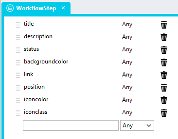
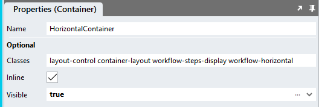
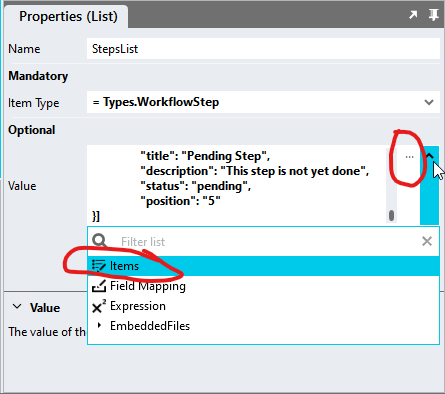
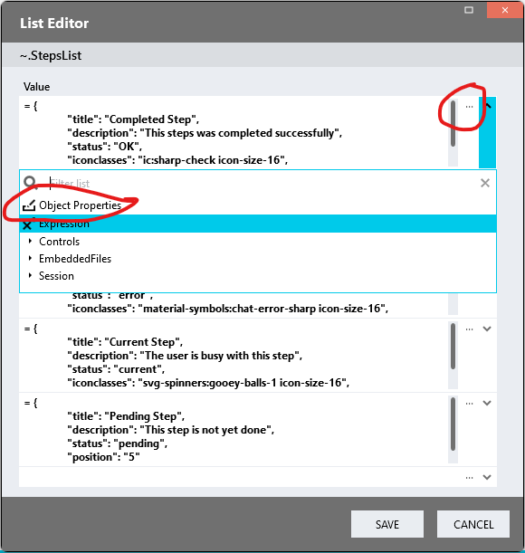
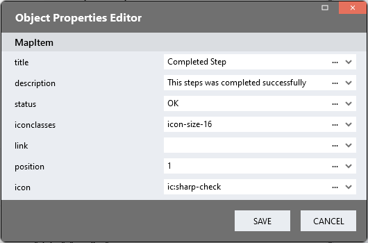
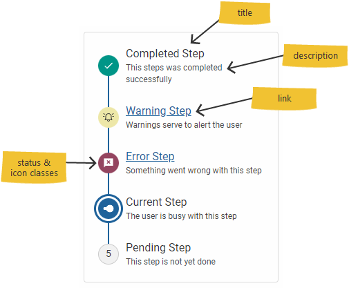
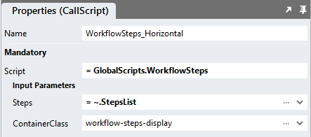

# WorkflowSteps v1

A module you can use to show workflow steps ([see version 2](../v2))

https://github.com/stadium-software/workflow-steps/assets/2085324/0fa1bae8-8bfa-487f-9b67-3d43e8428050

## Version 
1.0 - initial

1.1 - Improved Global Script calling method

# Setup

## Application Setup
1. Check the *Enable Style Sheet* checkbox in the application properties

## Type Setup
1. Create a new Type and call it "WorkflowStep"
2. Add the two properties below to the type
   1. title (Any)
   2. description (Any)
   3. status (Any)
   4. icon (Any)
   5. iconclasses (Any)
   6. link (Any)
   7. position (Any)



## Global Script Setup
1. Create a Global Script called "WorkflowSteps"
2. Add the input parameters below to the Global Script
   1. ContainerClass
   2. Steps
3. Drag a *JavaScript* action into the script
4. Add the Javascript below unchanged into the JavaScript code property
```javascript
/* Stadium Script Version 1.1 https://github.com/stadium-software/workflow-steps */
let arrSteps = ~.Parameters.Input.Steps;
let containerClassName = ~.Parameters.Input.ContainerClass;
let containerClass = "." + containerClassName;
if (!containerClass) { 
    console.error("A value for the parameter 'ContainerClass' must be provided");
    return false;
}
let container = document.querySelectorAll(containerClass);
if (container.length == 0 || container.length > 1) {
    console.error("The class '" + containerClassName + "' is not assigned to any or it is assigned to multiple workflow containers.");
    return false;
} else { 
    container = container[0];
}
container.classList.add("workflow-steps-container");
let callIcons = false;
let isHorizontal = container.classList.contains("workflow-horizontal");

const sortMe = (arr, key) => arr.sort((a, b) => (a[key] > b[key] ? 1 : a[key] < b[key] ? -1 : 0));
let wait = async (milliseconds) => new Promise((resolve) => setTimeout(resolve, milliseconds));
let icons = async () => {
    try {
        await this.$globalScripts().Icons();
        return true;
    } catch (error) {
        wait(100).then(() => icons());
    }
};
let initWorkflow = () => {
    arrSteps = sortMe(arrSteps, "Position");
    for (let i = 0; i < arrSteps.length; i++) {
        let pos = arrSteps[i].position;
        if (!pos || isNaN(parseFloat(pos))) pos = i + 1;
        let status = arrSteps[i].status;
        if (status) status = status.toLowerCase();
        if (!/^(ok|complete|completed|error|warning|current|done)$/.test(status)) { 
            status = "pending";
        }
        let icon = arrSteps[i].icon;
        let classes = "";
        let hasIcon = false;
        if (icon) {
            classes = icon;
            if (arrSteps[i].iconclasses) {
                classes += " " + arrSteps[i].iconclasses.toLowerCase();
                if (classes.indexOf("stadium-icon") == -1) classes += " stadium-icon";
            }
            callIcons = true;
            hasIcon = true;
        }
        let title = arrSteps[i].title;
        let description = arrSteps[i].description;
        let link = arrSteps[i].link;

        let item = document.createElement("div");
        item.setAttribute("status", status);
        item.classList.add("workflow-steps-item-container");
        if (!isHorizontal) item.style.gridTemplateAreas = '"icon title"';

        let titleEl;
        if (link) {
            titleEl = document.createElement("a");
            titleEl.classList.add("workflow-steps-item-link");
            titleEl.href = link;
            titleEl.innerText = title;
        } else {
            titleEl = document.createElement("div");
            titleEl.classList.add("workflow-steps-step-title");
            titleEl.innerText = title;
        }
        item.appendChild(titleEl);

        if (description) {
            let descriptionEl = document.createElement("div");
            descriptionEl.textContent = description;
            descriptionEl.classList.add("workflow-steps-step-description");
            item.appendChild(descriptionEl);
            if (!isHorizontal) item.style.gridTemplateAreas = '"icon title" "icon description"';
        }

        let iconEl = document.createElement("div");
        if (classes) iconEl.setAttribute("class", classes);
        iconEl.classList.add("workflow-steps-step-icon");
        let iconSpan = document.createElement("span");
        if (!hasIcon) { 
            iconSpan.textContent = pos;
        }
        iconEl.appendChild(iconSpan);
        item.appendChild(iconEl);

        container.appendChild(item);
    }
    if (callIcons) {
        icons();
    }
};
initWorkflow();
```

## Page Setup
1. Drag a *Container* control to a page 
2. Add a class to the *Container* classes property to uniquely identify the control (e.g. workflow-steps-display)
3. By default the workflow is displayed vertically. To change the direction to horizontal, add the class "workflow-horizontal" to the *Container* (e.g. workflow-steps-display workflow-horizontal)



## Page.Load Setup
1. Drag a *List* control into the Page.Load event handler and name it (e.g. StepsList)
2. Select the "WorkflowStep" type in the *Item Type* property dropdown of the *List*
3. In the *Value* property of the *List*, select *Items* in the dropdown or use the ... button to open the ListEditor



4. In the *ListEditor*, select *Object Properties* in the dropdown or use the ... button to open the ObjectEditor



5. Use the *Object Editor* to add your workflow steps
   1. title (string)
   2. description (string): Optionally a short description
   3. status (enum): The status is only used to style the icon step. By default, the listed here statuses are supported. To adjust status display styles or add new statuses see [Customising the display](#customising-the-display) below
      1. ok / complete / completed / done (any of these terms will work)
      2. error
      3. warning
      4. current
      5. pending (default)
   4. icon (optional): This parameter is only necessary if you want to use the [icons module](#icons) to display icons in the step  
   5. iconclasses (optional): This parameter is only necessary if you want to use the [icons module](#icons) to display icons in the step 
   6. link (relative or absolute url): Optionally, add a link
   7. position (int): The position of the step in the workflow

 

6. Drag the Global Script called "WorkflowSteps" into the Page.Load EventHandler
7. Provide values for the script input parameters
   1. Steps: Select the List containing the workflow steps (e.g. "StepsList")
   2. ContainerClass: Enter the classname you assigned to the *Container* control above (e.g. workflow-steps-display)



## Icons
There are two methods to display icons in workflow steps

### CSS icons
To display icons referenced in your StyleSheet, follow these steps
1. Craft selectors to match your statuses like below (the example is for the "pending" step)
2. Find an icon file you want to use 
   1. I like to use this site https://icones.js.org/collection/all
   2. Find and select an icon and select "Data URL"
   3. Paste the value into the background-image: url() function as shown below
3. Add the remaining attributes shown in the example below
```css
#app .workflow-steps-item-container[status='pending'] .workflow-steps-step-icon {
    /*Wrap icon value in double quotes as shown*/
    background-image: url("data:image/svg+xml;base64,PHN2ZyB4bWxucz0iaHR0cDovL3d3dy53My5vcmcvMjAwMC9zdmciIHdpZHRoPSIxZW0iIGhlaWdodD0iMWVtIiB2aWV3Qm94PSIwIDAgMjQgMjQiPjxwYXRoIGZpbGw9IiMyNDI0MjQiIGQ9Ik01IDIxcS0uODI1IDAtMS40MTItLjU4N1QzIDE5VjVxMC0uODI1LjU4OC0xLjQxMlQ1IDNoOC45MjVsLTIgMkg1djE0aDE0di02Ljk1bDItMlYxOXEwIC44MjUtLjU4NyAxLjQxM1QxOSAyMXptNC02di00LjI1bDkuMTc1LTkuMTc1cS4zLS4zLjY3NS0uNDV0Ljc1LS4xNXEuNCAwIC43NjMuMTV0LjY2Mi40NUwyMi40MjUgM3EuMjc1LjMuNDI1LjY2M1QyMyA0LjR0LS4xMzcuNzM4dC0uNDM4LjY2MkwxMy4yNSAxNXpNMjEuMDI1IDQuNGwtMS40LTEuNHpNMTEgMTNoMS40bDUuOC01LjhsLS43LS43bC0uNzI1LS43TDExIDExLjU3NXptNi41LTYuNWwtLjcyNS0uN3psLjcuN3oiLz48L3N2Zz4=");
	background-repeat: no-repeat;
	background-position: center;
	background-size: 20px; 
	font-size: 0px;
}
```

### Icons module
In order to display icons using the Icons module, the [Icons Module](https://github.com/stadium-software/icons) must be implemented in the application. There is no need to call the "Icons" script from this repo as it will, if necessary, be called by the "WorkflowSteps" script below. The "Icons" Global Script and CSS files must, however, exist in the GlobalScripts and EnbeddedFiles folders as described in the [Icons](https://github.com/stadium-software/icons) repo. To implement an icon, follow these steps:

1. Implement the [Icons](https://github.com/stadium-software/icons) module
2. Locate the icon name (see [Finding an icon](https://github.com/stadium-software/icons#finding-an-icon))
3. Copy the name of the symbol (e.g. ic:sharp-check or svg-spinners:gooey-balls-1) and paste it into the icon parameter

**Styling icons**

If you are using icons, you can additionally define the icon colours and sizes as classes (space-separated) (e.g. icon-size-16 icon-color-red) (see [Icon Styles](https://github.com/stadium-software/icons#icon-styles))

## Customising the display
The *workflow-steps-variables.css* file included in this repo contains a set of variables that can be changed to customise the workflow-steps implementation 
1. Open the CSS file called [*workflow-steps-variables.css*](workflow-steps-variables.css) from this repo in an editor of your choice (I recommend [VS Code](https://code.visualstudio.com/))
2. Adjust the variables in the *:root* element as you see fit to change the general workflow display
3. Adjust the variables in the status-specific elements to adjust the display of any specific status (e.g. .workflow-steps-item-container[status='warning'])
4. Add a class to display additional statuses as per the examples provided in the [*workflow-steps-variables.css*](workflow-steps-variables.css) file and add the corresponding status in the workflow step *status* property

## Applying the CSS
The CSS below is required for the correct functioning of the module. Some elements can be customised using a variables CSS file. How to apply the CSS to your application

1. Create a folder called *CSS* inside of your Embedded Files in your application
2. Drag the two CSS files from this repo [*workflow-steps-variables.css*](workflow-steps-variables.css) and [*workflow-steps.css*](workflow-steps.css) into that folder
3. Paste the link tags below into the *head* property of your application
```html
<link rel="stylesheet" href="{EmbeddedFiles}/CSS/workflow-steps.css">
<link rel="stylesheet" href="{EmbeddedFiles}/CSS/workflow-steps-variables.css">
``` 

## CSS Upgrading
To upgrade the CSS in this module, follow the [steps outlined in this repo](https://github.com/stadium-software/samples-upgrading)
