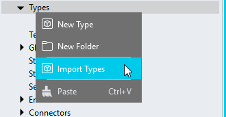

# WorkflowSteps v1

A module you can use to show workflow steps ([see version 2](../v2))

https://github.com/stadium-software/workflow-steps/assets/2085324/0fa1bae8-8bfa-487f-9b67-3d43e8428050

## Version 
1.1 Improved Global Script calling method

1.2 Integrated CSS with script; improved customisation options; changed type properties

# Setup

## Application Setup
1. Check the *Enable Style Sheet* checkbox in the application properties

## Type Setup
You can import the type or create it manually


### Type Import
1. Right-click on the `Types` node in the `Application Explorer`



2. In the `Import Type` popup
    1. Add "WorkflowStep" into the `Name` input field
    2. Copy & paste the JSON below into the main input area

```json
{
	"title": "",
	"description": "",
    "link": "",
    "status": "",
	"iconclass": "",
	"iconcolor": "",
	"backgroundcolor": "",
	"position": 0
}
```

### Manual Type Setup
1. Create a new Type and call it "WorkflowStep"
2. Add the two properties below to the type
   1. title (Any)
   2. description (Any)
   3. status (Any)
   4. iconclass (Any)
   5. iconcolor (Any)
   6. link (Any)
   7. backgroundcolor (any)
   8. position (Any)

## Global Script Setup
1. Create a Global Script called "WorkflowSteps"
2. Add the input parameters below to the Global Script
   1. ContainerClass
   2. Steps
3. Drag a *JavaScript* action into the script
4. Add the Javascript below unchanged into the JavaScript code property
```javascript
/* Stadium Script Version 1.2 https://github.com/stadium-software/workflow-steps */
let arrSteps = ~.Parameters.Input.Steps;
const containerClassName = ~.Parameters.Input.ContainerClass;
if (!Array.isArray(arrSteps) || arrSteps.length === 0) {
    console.error("Steps array must be provided and contain at least one step");
    return false;
}
if (!containerClassName) { 
    console.error("A value for the parameter 'ContainerClass' must be provided");
    return false;
}
const containerClass = `.${containerClassName}`;
let container = document.querySelectorAll(containerClass);
if (container.length == 0 || container.length > 1) {
    console.error(`The class '${containerClassName}' is not assigned to any or it is assigned to multiple workflow containers.`);
    return false;
} else { 
    container = container[0];
}
container.classList.add("workflow-steps-container");
const STATUS_REGEX = /^(complete|completed|error|warning|current|done|pending)$/;
let isHorizontal = container.classList.contains("workflow-horizontal");

const sortMe = (arr, key) => arr.sort((a, b) => (a[key] > b[key] ? 1 : a[key] < b[key] ? -1 : 0));
const classRules = [];
let initWorkflow = () => {
    let sortedSteps = sortMe(arrSteps, "position");
    sortedSteps.forEach((step, index) => {
        const pos = (!step.position || isNaN(parseFloat(step.position))) ? index + 1 : step.position;
        const status = step.status?.toLowerCase();
        let knownStatus = STATUS_REGEX.test(status);
        let iconClass = step.iconclass;
        let iconColor = step.iconcolor;
        let title = step.title;
        let description = step.description;
        let backgroundcolor = step.backgroundcolor;
        let link = step.link;

        let item = document.createElement("div");
        if (knownStatus) {
            item.setAttribute("status", status);
        }
        item.classList.add("workflow-item-container");
        if (!isHorizontal) item.style.gridTemplateAreas = '"icon title"';

        let titleEl;
        if (link) {
            titleEl = document.createElement("a");
            titleEl.classList.add("workflow-item-link");
            titleEl.href = link;
            titleEl.textContent = title;
        } else {
            titleEl = document.createElement("div");
            titleEl.classList.add("workflow-step-title");
            titleEl.textContent = title;
        }
        item.appendChild(titleEl);

        if (description) {
            const descriptionEl = document.createElement("div");
            descriptionEl.textContent = description;
            descriptionEl.classList.add("workflow-step-description");
            item.appendChild(descriptionEl);
            if (!isHorizontal) item.style.gridTemplateAreas = '"icon title" "icon description"';
        }

        const iconEl = document.createElement("div");
        iconEl.classList.add("workflow-step");
        if (iconClass || knownStatus) {
            iconEl.classList.add("workflow-step-icon");
        }
        if (backgroundcolor) {
            iconEl.style.backgroundColor = backgroundcolor;
        }

        if (iconClass) iconEl.classList.add(iconClass);
        if (iconColor && knownStatus) document.documentElement.style.setProperty(`--workflow-item-${status}-icon-color`, iconColor);
        if (iconColor && iconClass) {
            const classRule = `.${iconClass}:after { background-color: ${iconColor}; }`;
            classRules.push(classRule);
        }
        let iconSpan = document.createElement("span");
        if (!iconClass) {
            iconSpan.textContent = pos;
        }
        iconEl.appendChild(iconSpan);
        item.appendChild(iconEl);
        container.appendChild(item);
    });
    const stylesheet = document.getElementById("stadium-workflows");
    if (classRules.length > 0) {
        stylesheet.appendChild(document.createTextNode(classRules.join('\n')));
    }
};
loadCSS();
initWorkflow();
function loadCSS() {
    const moduleID = "stadium-workflows";
    const moduleCSS = document.getElementById(moduleID);
    if (moduleCSS) { moduleCSS.remove(); }
        const cssMain = document.createElement("style");
        cssMain.id = moduleID;
        cssMain.type = "text/css";
        cssMain.textContent = `
/* CSS version 1.2 https: //github.com/stadium-software/workflow-steps */
.workflow-steps-container.workflow-steps-container {
    --workflow-container-background-line-starting-pos: calc(var(--workflow-container-padding, 20px) + (var(--workflow-item-circle-size, 30px) / 2) - (var(--workflow-container-background-line-thickness, 2px) / 2));
    
    display: inline-flex;
    flex-direction: column;
    width: var(--workflow-container-width, auto);
    background-color: var(--workflow-container-background-color, var(--BODY-BACKGROUND-COLOR));
    padding: var(--workflow-container-padding, 20px);
    border: 1px solid var(--workflow-container-border-color, var(--DARKER-GREY));
    border-radius: var(--workflow-container-border-radius, 4px);
    align-items: stretch;
    justify-items: center;
    gap: var(--workflow-steps-gap, 26px);
    background-image: 
        linear-gradient(to bottom, var(--workflow-container-background-color, var(--BODY-BACKGROUND-COLOR)) var(--workflow-container-background-line-starting-pos), transparent var(--workflow-container-background-line-starting-pos)),
        linear-gradient(to bottom, transparent calc(100% - var(--workflow-container-background-line-starting-pos)), var(--workflow-container-background-color, var(--BODY-BACKGROUND-COLOR)) calc(100% - var(--workflow-container-background-line-starting-pos))),
        linear-gradient(to right, var(--workflow-container-background-color, var(--BODY-BACKGROUND-COLOR)) var(--workflow-container-background-line-starting-pos), var(--workflow-container-background-line-color, var(--SECONDARY-THEME-COLOR)) var(--workflow-container-background-line-starting-pos), var(--workflow-container-background-line-color, var(--SECONDARY-THEME-COLOR)) calc(var(--workflow-container-background-line-starting-pos) + var(--workflow-container-background-line-thickness, 2px)), var(--workflow-container-background-color, var(--BODY-BACKGROUND-COLOR)) calc(var(--workflow-container-background-line-starting-pos) + var(--workflow-container-background-line-thickness, 2px)));

    .workflow-item-container {
        display: inline-grid;
        grid-column-gap: var(--workflow-item-icon-distance-from-title, 10px);
        grid-template-columns: var(--workflow-item-circle-size, 30px) minmax(auto, var(--workflow-step-max-width, 200px));
        align-items: center;
        grid-template-areas:
            "icon title"
            "icon description";
        width: 100%;
        height: 100%;

        .workflow-step {
            grid-area: icon;
            align-self: center;
            display: grid;
            place-items: center;
            position: relative;
            border-width: var(--workflow-item-circle-border-size, 1px);
            border-style: var(--workflow-item-circle-border-style, solid);
            border-radius: 50%;
            border-color: var(--workflow-item-circle-border-color, transparent);
            border-radius: 50%;
            background-color: var(--workflow-item-icon-background-color, var(--DARKER-GREY));
            background-position: center;
            height: var(--workflow-item-circle-size, 30px);
            width: var(--workflow-item-circle-size, 30px);
            color: var(--workflow-item-icon-color, var(--BODY-FONT-COLOR));
            aspect-ratio: 1;
            margin-bottom: 0;
            align-self: start;
            place-items: center;
            margin-bottom: var(--workflow-item-icon-distance-from-title, 10px);
            span {
                display: grid;
                place-content: center;
                height: var(--workflow-item-circle-size, 30px);
            }
        }

        .workflow-step-description {
            grid-area: description;
            font-size: var(--workflow-item-description-font-size, var(--FONT-SIZE-SMALL));
            color: var(--workflow-item-description-font-color, var(--BODY-FONT-COLOR));
            text-align: left;
        }

        .workflow-step-title {
            grid-area: title;
            font-size: var(--workflow-item-title-font-size, var(--FONT-SIZE-LARGER));
            font-weight: var(--workflow-item-title-font-weight, normal);
            color: var(--workflow-item-title-font-color, var(--BODY-FONT-COLOR));
            text-align: left;
        }

        .workflow-item-link {
            grid-area: title;
            font-size: var(--workflow-item-title-font-size, var(--FONT-SIZE-LARGER));
            font-weight: var(--workflow-item-title-font-weight, normal);
            color: var(--workflow-item-link-color, var(--LINK-COLOR));
            text-decoration: var(--workflow-item-link-underline, var(--LINK-DECORATION));
            text-align: left;
        }
    }
    .workflow-item-container:first-child {
        background-image: linear-gradient(to bottom, var(--workflow-container-background-color, var(--BODY-BACKGROUND-COLOR)) 50%, transparent 50%);
    }
    .workflow-item-container:last-child {
        background-image: linear-gradient(to bottom, transparent 50%, var(--workflow-container-background-color, var(--BODY-BACKGROUND-COLOR)) 50%);
    }

    &:is(.workflow-horizontal) {
        flex-direction: row;
        justify-items: start;
        background-image: 
            linear-gradient(to right, var(--workflow-container-background-color, var(--BODY-BACKGROUND-COLOR)) var(--workflow-container-background-line-starting-pos), transparent var(--workflow-container-background-line-starting-pos)),
            linear-gradient(to right, transparent calc(100% - var(--workflow-container-background-line-starting-pos)), var(--workflow-container-background-color, var(--BODY-BACKGROUND-COLOR)) calc(100% - var(--workflow-container-background-line-starting-pos))),
            linear-gradient(to bottom, var(--workflow-container-background-color, var(--BODY-BACKGROUND-COLOR)) var(--workflow-container-background-line-starting-pos), var(--workflow-container-background-line-color, var(--SECONDARY-THEME-COLOR)) var(--workflow-container-background-line-starting-pos), var(--workflow-container-background-line-color, var(--SECONDARY-THEME-COLOR)) calc(var(--workflow-container-background-line-starting-pos) + var(--workflow-container-background-line-thickness, 2px)), var(--workflow-container-background-color, var(--BODY-BACKGROUND-COLOR)) calc(var(--workflow-container-background-line-starting-pos) + var(--workflow-container-background-line-thickness, 2px)));

        .workflow-item-container {
            grid-template-columns: auto;
            grid-template-areas:
                "icon"
                "title"
                "description";
            place-items: center;
            grid-column-gap: 0;

            .workflow-step-description, 
            .workflow-step-title,
            .workflow-item-link {
                text-align: center;
            }
        }
        .workflow-item-container:first-child {
            background-image: linear-gradient(to right, var(--workflow-container-background-color, var(--BODY-BACKGROUND-COLOR)) 50%, transparent 50%);
        }
        .workflow-item-container:last-child {
            background-image: linear-gradient(to right, transparent 50%, var(--workflow-container-background-color, var(--BODY-BACKGROUND-COLOR)) 50%);
        }
    }

    .workflow-step-icon {
        font-size: 0px;
        position: relative;
    }
    .workflow-step-icon:after {
        position: absolute;
        content: "";
        mask-repeat: no-repeat;
        mask-position: center;
        mask-size: contain;
    }

    .workflow-item-container[status] .workflow-step-icon:after {
        height: var(--workflow-item-icon-size, 24px);
        width: var(--workflow-item-icon-size, 24px);
    }

    .workflow-item-container[status='completed'],
    .workflow-item-container[status='complete'] {
        .workflow-step-icon {
            background-color: var(--workflow-item-completed-icon-background-color, #009688);
        }
        .workflow-step-icon:after {
            mask-image: url("data:image/svg+xml,%3Csvg xmlns='http://www.w3.org/2000/svg' width='1em' height='1em' viewBox='0 0 24 24' %3E%3Cpath fill='currentColor' d='m10.5 16.2l-4-4l1.4-1.4l2.6 2.6l5.6-5.6l1.4 1.4Z'/%3E%3C/svg%3E");
            background-color: var(--workflow-item-completed-icon-color, #ffffff);
        }
    }

    .workflow-item-container[status='error'] {
        .workflow-step-icon {
            background-color: var(--workflow-item-error-icon-background-color, #954661);
        }
        .workflow-step-icon:after {
            mask-image: url("data:image/svg+xml,%3Csvg xmlns='http://www.w3.org/2000/svg' width='1em' height='1em' viewBox='0 0 24 24' %3E%3Cpath fill='currentColor' d='m17.705 7.705l-1.41-1.41L12 10.59L7.705 6.295l-1.41 1.41L10.59 12l-4.295 4.295l1.41 1.41L12 13.41l4.295 4.295l1.41-1.41L13.41 12z'/%3E%3C/svg%3E");
            background-color: var(--workflow-item-error-icon-color, #ffffff);
        }
    }

    .workflow-item-container[status='warning'] {
        .workflow-step-icon {
            background-color: var(--workflow-item-warning-icon-background-color, #EEE8A9);
        }
        .workflow-step-icon:after {
            mask-image: url("data:image/svg+xml,%3Csvg xmlns='http://www.w3.org/2000/svg' width='1em' height='1em' viewBox='0 0 24 24' %3E%3Cpath fill='none' stroke='currentColor' stroke-linecap='round' stroke-linejoin='round' stroke-width='2' d='M12 6v8m.05 4v.1h-.1V18z'/%3E%3C/svg%3E");
            background-color: var(--workflow-item-warning-icon-color, #333333);
        }
    }

    .workflow-item-container[status='current'] {
        .workflow-step-icon {
            background-color: var(--workflow-item-current-icon-background-color, #20639B);
            outline: 3px solid var(--workflow-item-current-circle-border-color, #20639B);
            outline-offset: 3px;
            box-shadow: 0 0 0 3px var(--workflow-container-background-color);
        }
        .workflow-step-icon:after {
            mask-image: url("data:image/svg+xml,%3Csvg xmlns='http://www.w3.org/2000/svg' width='1em' height='1em' viewBox='0 0 24 24' %3E%3Cdefs%3E%3Cfilter id='SVGp0LL3caJ'%3E%3CfeGaussianBlur in='SourceGraphic' result='y' stdDeviation='1'/%3E%3CfeColorMatrix in='y' result='z' values='1 0 0 0 0 0 1 0 0 0 0 0 1 0 0 0 0 0 18 -7'/%3E%3CfeBlend in='SourceGraphic' in2='z'/%3E%3C/filter%3E%3C/defs%3E%3Cg filter='url(%23SVGp0LL3caJ)'%3E%3Ccircle cx='5' cy='12' r='4' fill='currentColor'%3E%3Canimate attributeName='cx' calcMode='spline' dur='2s' keySplines='.36,.62,.43,.99;.79,0,.58,.57' repeatCount='indefinite' values='5;8;5'/%3E%3C/circle%3E%3Ccircle cx='19' cy='12' r='4' fill='currentColor'%3E%3Canimate attributeName='cx' calcMode='spline' dur='2s' keySplines='.36,.62,.43,.99;.79,0,.58,.57' repeatCount='indefinite' values='19;16;19'/%3E%3C/circle%3E%3CanimateTransform attributeName='transform' dur='0.75s' repeatCount='indefinite' type='rotate' values='0 12 12;360 12 12'/%3E%3C/g%3E%3C/svg%3E");
            background-color: var(--workflow-item-current-icon-color, #ffffff);
        }
    }

    .workflow-item-container[status='pending'] {
        .workflow-step-icon {
            background-color: var(--workflow-item-pending-icon-background-color, #cccccc);
        }
        .workflow-step-icon:after {
            mask-image: url("data:image/svg+xml,%3Csvg xmlns='http://www.w3.org/2000/svg' width='1em' height='1em' viewBox='0 0 24 24' %3E%3Cpath fill='currentColor' d='M8 14q.425 0 .713-.288T9 13t-.288-.712T8 12t-.712.288T7 13t.288.713T8 14m4 0q.425 0 .713-.288T13 13t-.288-.712T12 12t-.712.288T11 13t.288.713T12 14m4 0q.425 0 .713-.288T17 13t-.288-.712T16 12t-.712.288T15 13t.288.713T16 14m-4 8q-1.875 0-3.512-.712t-2.85-1.925t-1.925-2.85T3 13t.713-3.512t1.924-2.85t2.85-1.925T12 4t3.513.713t2.85 1.925t1.925 2.85T21 13t-.712 3.513t-1.925 2.85t-2.85 1.925T12 22M5.6 2.35L7 3.75L2.75 8l-1.4-1.4zm12.8 0l4.25 4.25l-1.4 1.4L17 3.75zM12 20q2.925 0 4.963-2.037T19 13t-2.037-4.962T12 6T7.038 8.038T5 13t2.038 4.963T12 20'/%3E%3C/svg%3E");
            background-color: var(--workflow-item-pending-icon-color, #333);
        }
    }
}        `;
        document.head.appendChild(cssMain);
}
```

## Page Setup
1. Drag a *Container* control to a page 
2. Add a class to the *Container* classes property to uniquely identify the control (e.g. workflow-steps-display)

### Display Direction
By default the workflow is displayed vertically. 

To change the direction to horizontal, add the class 'workflow-horizontal' to the *Container* (e.g. workflow-steps-display workflow-horizontal)


## Page.Load Setup
1. Drag a *List* control into the Page.Load event handler and name it (e.g. StepsList)
2. Select the "WorkflowStep" type in the *Item Type* property dropdown of the *List*
3. Create a `List` of objects containing all workflow steps you want to display
4. Use the *Object Editor* or paste the json below into the `Expression Editor` and amend it as required
   1. title (optional): The title for the step
   2. description (optional): A subtitle to display under the title
   3. status (optional): The following predefined statuses come with icons and clours, but you can also [add your own](#custom-status)
      1. completed
      2. error
      3. warning
      4. current
      5. pending
   4. iconclass (optional): Add a class and some CSS to show a [custom status](#custom-status) with a custom icon
   5. iconcolor (optional): Add a color name or CSS color in any format
   6. link (optional): To turn a title into a link, add a URL
   7. backgroundcolor (optional): To customise the step circle background color, add a color name or CSS color in any format
   8. position (optional): To define a specific position for a step, add a number
5. Drag the Global Script called "WorkflowSteps" into the Page.Load EventHandler
6. Provide values for the script input parameters
   1. Steps: Select the List containing the workflow steps (e.g. "StepsList")
   2. ContainerClass: Enter the classname you assigned to the *Container* control above (e.g. workflow-steps-display)


Example steps:
```json
[{
	"title": "Completed Step",
	"description": "This steps was completed successfully",
	"status": "completed"
},{
	"title": "Warning Step",
	"description": "Warnings serve to alert the user",
	"status": "warning",
	"link": "link-to-page"
},{
	"title": "Error Step",
	"description": "Something went wrong with this step",
	"status": "error",
	"link": "link-to-page"
},{
	"title": "Current Step",
	"description": "The user is busy with this step",
	"status": "current"
},{
	"title": "Pending Step",
	"description": "This step is not yet done",
	"status": "pending",
	"backgroundcolor": "#aaaaaa",
	"iconcolor": "#ffffff",
	"position": 2
},{
	"title": "Custom Icon",
	"description": "Customised icon and icon size",
	"iconclass": "todo",
	"iconcolor": "red",
	"backgroundcolor": "#EEE8A9",
	"position": 1
}]
```

## Custom Status
To display a custom step, follow these steps
1. Find an icon file you want to use here https://icones.js.org/collection/all
   1. Find and select an icon and select "Data URL"
   2. Paste the value into the background-image: url() function as shown below
3. Add the class into the step `iconclass` property in the "StepsList"
4. Add a `backgroundcolor` property and a colour
```css
.todo:after {
	mask-image: url("data:image/svg+xml,%3Csvg xmlns='http://www.w3.org/2000/svg' width='1em' height='1em' viewBox='0 0 24 24'%3E%3C!-- Icon from Material Symbols by Google - https://github.com/google/material-design-icons/blob/master/LICENSE --%3E%3Cpath fill='currentColor' d='m9 20l-1.4-1.4l1.75-1.8q-3.2-.425-5.275-1.75T2 12q0-2.075 2.888-3.537T12 7t7.113 1.463T22 12q0 1.55-1.662 2.775T16 16.6v-2.05q1.925-.5 2.963-1.237T20 12q0-.8-2.137-1.9T12 9t-5.863 1.1T4 12q0 .6 1.275 1.438T8.9 14.7l-1.3-1.3L9 12l4 4z'/%3E%3C/svg%3E");
	height: 18px;
    width: 18px;
}
```

## Customisations
The *workflow-steps-variables.css* file included in this repo contains a set of variables that can be changed to customise the workflow-steps implementation 
1. Open the CSS file called [*workflow-steps-variables.css*](workflow-steps-variables.css) from this repo in an editor of your choice (I recommend [VS Code](https://code.visualstudio.com/))
2. Adjust the variables in the *:root* element as you see fit to change the general workflow display

### Applying the CSS
How to apply the CSS to your application
1. Create a folder called *CSS* inside of your Embedded Files in your application
2. Drag the two CSS files from this repo [*workflow-steps-variables.css*](workflow-steps-variables.css) and [*workflow-steps.css*](workflow-steps.css) into that folder
3. Paste the link tags below into the *head* property of your application
```html
<link rel="stylesheet" href="{EmbeddedFiles}/CSS/workflow-steps-variables.css">
``` 

## CSS Upgrading
To upgrade the CSS in this module, follow the [steps outlined in this repo](https://github.com/stadium-software/samples-upgrading)
