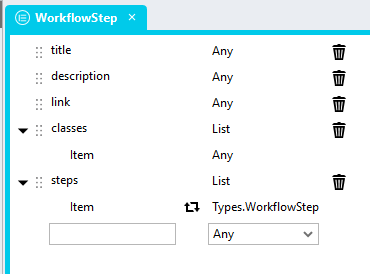
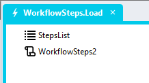
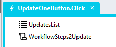

# WorkflowSteps v2 <!-- omit in toc -->

A module you can use to show workflow steps

https://github.com/user-attachments/assets/2094e1bc-75e4-4e05-87fd-e4e9a2f3bb5e

## Table Of Contents <!-- omit in toc -->
- [Version](#version)
- [Setup](#setup)
  - [Application Setup](#application-setup)
  - [Type Setup](#type-setup)
  - [Global Script Setup](#global-script-setup)
  - [Page Setup](#page-setup)
  - [Page.Load Setup](#pageload-setup)
  - [Workflow Step Statuses](#workflow-step-statuses)
    - [Preconfigured Statuses](#preconfigured-statuses)
    - [Custom Statuses](#custom-statuses)
- [Updating Steps](#updating-steps)
  - [Type Setup](#type-setup-1)
  - [Global Script Setup](#global-script-setup-1)
  - [Event Handler Setup](#event-handler-setup)
- [Applying the CSS](#applying-the-css)
- [Upgrading](#upgrading)

# Version 
2.0 - initial

# Setup

## Application Setup
1. Check the *Enable Style Sheet* checkbox in the application properties

## Type Setup
1. Create a new Type and call it "WorkflowStep"
2. Add the two properties below to the type
   1. title (Any)
   2. description (Any)
   3. link (Any)
   4. classes (List)
      1. Item (Any)
   5. steps (List)
      1. Item (Types.WorkflowStep)



## Global Script Setup
1. Create a Global Script called "WorkflowSteps2"
2. Add the input parameters below to the Global Script
   1. ContainerClass
   2. Steps
3. Drag a *JavaScript* action into the script
4. Add the Javascript below unchanged into the JavaScript code property
```javascript
/* Stadium Script Version 2.0 https://github.com/stadium-software/workflow-steps */
let arrSteps = ~.Parameters.Input.Steps;
let containerClassName = ~.Parameters.Input.ContainerClass;
if (!containerClassName) { 
    console.error("A value for the parameter 'ContainerClass' must be provided");
    return false;
}
let containerClass = "." + containerClassName;
let container = document.querySelectorAll(containerClass);
if (container.length == 0 || container.length > 1) {
    console.error("The class '" + containerClassName + "' is not assigned to any or it is assigned to multiple workflow containers.");
    return false;
} else { 
    container = container[0];
}
let update = document.querySelector(".workflow-steps-container" + containerClass);
if (update) {
    update.innerHTML = "";
} else {
    container.classList.add("workflow-steps-container");
}

function createStep(title, description, link, cssclasses, steps) { 
    let fragment = new DocumentFragment();

    let item = document.createElement("div");
    item.classList.add("workflow-steps-item-container");
    for (let c = 0;c<cssclasses.length;c++) {
        item.classList.add(cssclasses[c]);
    }
    let titleEl = document.createElement("div"),
        titleContent;
    if (link) {
        titleContent = document.createElement("a");
        titleContent.href = link;
        titleContent.innerText = title;
    } else {
        titleContent = document.createElement("span");
        titleContent.innerText = title;
    }
    titleEl.classList.add("workflow-steps-step-title");
    titleEl.appendChild(titleContent);
    item.appendChild(titleEl);

    if (description) {
        item.setAttribute("title",description);
    }

    fragment.appendChild(item);
    container.appendChild(fragment);

    if (steps) { 
        for (let s = 0; s < steps.length; s++) { 
            steps[s].classes.push("substep");
            let substep = createStep(steps[s].title, steps[s].description, steps[s].link, steps[s].classes, steps[s].steps);
            item.appendChild(substep);
        }
    }
    return item;
}
if (arrSteps) {
    for (let i = 0; i < arrSteps.length; i++) {
        arrSteps[i].classes.push("mainstep");
        let step = createStep(arrSteps[i].title, arrSteps[i].description, arrSteps[i].link, arrSteps[i].classes, arrSteps[i].steps);
        container.appendChild(step);
    }
}
```

## Page Setup
1. Drag a *Container* control to a page 
2. Add a class to the *Container* classes property to uniquely identify the control (e.g. workflow-steps)

## Page.Load Setup
1. Drag a *List* control into the Page.Load event handler and name it (e.g. StepsList)
2. Select the "WorkflowStep" type in the *Item Type* property dropdown of the *List*
3. Define the workflow steps
   1. title: The label shown at the top level of the step
   2. classes: A list of CSS classes attached to the step. Attach 
      1. A unique classname to identify the step (e.g. step1-3). This can later be used to update the step. 
      2. A status (e.g. pending, current or success - see [Workflow Step Statuses](#workflow-step-statuses) below). 
   3. link: A link for the step
   4. description: Text to show in a tooltip on hover of the step
   5. steps: A set of sub-steps (the module only supports one sub-level of steps) 



Example Workflow Definition:
```json
[{
	"title": "File Upload",
	"classes":["step1", "success"],
    "link": "/FileUploadPage",
	"steps": [{
		"title": "File 1",
		"link": "/File1Upload",
		"classes": ["substep3-1", "success"]
	},{
		"title": "File 2",
		"link": "/File2Upload",
		"classes": ["substep3-2", "success"]
	}]
},{
	"title": "Data Import",
	"classes": ["step2", "success"],
    "link": "/DataImportPage",
	"steps": [{
		"title": "Validation",
		"classes": ["substep3-1", "success"]
	},{
		"title": "Enrichment",
		"classes": ["substep3-2", "warning"],
		"description": "Item 12:14 was empty"
	},{
		"title": "Import",
		"classes": ["substep3-3", "error"],
		"description": "Import failed due to an error on 12:14"
	}]
},{
	"title": "Review",
	"classes": ["step3", "current"],
	"link": "/ReviewPage",
	"steps": [{
		"title": "Dataset 1",
		"classes": ["substep3-1","current"]
	},{
		"title": "Dataset 2",
		"classes": ["substep3-2","pending"]
	}]
},{
	"title": "Report Generation",
	"classes": ["step4", "pending"],
	"link": "/GenerationPage",
	"steps": [{
		"title": "Report 1",
		"classes": ["substep4-1", "pending"]
	},{
		"title": "Report 2",
		"classes": ["substep4-2", "pending"]
	}]
},{
	"title": "Report Delivery",
	"classes": ["step5", "pending"],
	"link": "/ReportSendPage",
	"steps": [{
		"title": "Email 1",
		"classes": ["substep5-1", "pending"]
	},{
		"title": "Email 2",
		"classes": ["substep5-2", "pending"]
	}]
}]
```

4. Drag the Global Script called "WorkflowSteps2" to the event handler
5. Complete the input parameters
   1. Steps: The list of steps (e.g. StepsList)
   2. ContainerClass: The class you added to the *Container* control (e.g. workflow-steps)

## Workflow Step Statuses
The module comes with a set of preconfigured statuses that can be customised as required. Additional custom statuses can also be added. 

### Preconfigured Statuses
The module comes with five preconfigured statuses:
- pending
- success
- current
- warning
- error

The default styling for each status can be changed in the [*workflow-steps2-variables.css*](workflow-steps2-variables.css) file. 

### Custom Statuses

Additional statuses can also be added by 
1. Defining classes for them in the stylesheet
2. Adding the class to the "classes" property of that step or substep

Example status (mystatus) CSS:
```css
/*main step with class 'mystatus'*/
.workflow-steps-item-container.mainstep.mystatus > .workflow-steps-step-title > span {
    font-weight: bold;
}
/*substep with class 'mystatus'*/
.substep.mystatus {
    /*icon*/
    background-image: url("data:image/svg+xml,%3Csvg xmlns='http://www.w3.org/2000/svg' width='1em' height='1em' viewBox='0 0 48 48'%3E%3C!-- Icon from All by undefined - undefined --%3E%3Cpath fill='none' stroke='%23FFFFFF' stroke-linecap='round' stroke-linejoin='round' stroke-width='4' d='m6 11l5-5l13 13L37 6l5 5l-13 13l13 13l-5 5l-13-13l-13 13l-5-5l13-13z' clip-rule='evenodd'/%3E%3C/svg%3E");
    /*background color*/
    background-color: orange;
    /*font color*/
    color: #333;
    a {
        /*link font color*/
        color: #333;
    }
}
```

# Updating Steps
A separate type and script are needed to update steps

## Type Setup
1. Create a new Type and call it "WorkflowStepsUpdate"
2. Add the properties below to the type
   1. stepclass (Any)
   2. description (Any)
   3. addremoveclasses (List)
      1. Item (Any)


## Global Script Setup
1. Create a Global Script called "WorkflowStepsUpdate"
2. Add the input parameters below to the Global Script
   1. ContainerClass
   2. Updates
3. Drag a *JavaScript* action into the script
4. Add the Javascript below unchanged into the JavaScript code property
```javascript
/* Stadium Script Version 2.0 https://github.com/stadium-software/workflow-steps */
let arrupdates = ~.Parameters.Input.Updates;
let containerClassName = ~.Parameters.Input.ContainerClass;
if (!containerClassName) { 
    console.error("A value for the parameter 'ContainerClass' must be provided");
    return false;
}
let containerClass = "." + containerClassName;
let container = document.querySelectorAll(containerClass);
if (container.length == 0 || container.length > 1) {
    console.error("The class '" + containerClassName + "' is not assigned to any or it is assigned to multiple workflow containers.");
    return false;
} else { 
    container = container[0];
}
for (let i = 0; i < arrupdates.length; i++) {
    let stepclass = arrupdates[i].stepclass;
    let stepEls = container.querySelectorAll("." + stepclass);
    for (let j = 0; j < stepEls.length; j++) {
        let addremoveclasses = arrupdates[i].addremoveclasses;
        let description = arrupdates[i].description;
        if (description) stepEls[j].setAttribute("title", description);
        for (let k = 0; k < addremoveclasses.length; k++) {
            let addremoveclass = addremoveclasses[k];
            if (stepEls[j].classList.contains(addremoveclass)) {
                stepEls[j].classList.remove(addremoveclass);
            } else {
                stepEls[j].classList.add(addremoveclass);
            }
        }
    }
}
```

## Event Handler Setup
1. Drag a *List* action into the Page.Load event handler and name it (e.g. UpdatesList)
2. Select the "WorkflowStepsUpdate" type in the *Item Type* property dropdown of the *List*
3. Define which workflow steps to update and how
   1. stepclass: A class that uniquely identifies one step or a class that identifies multiple steps to update (this should have been added in the "StepsList" list above)
   2. description: Text to show in a tooltip on hover of the step
   3. addremoveclasses: A list of classes that will be added (if they don't exist on the step) or removed (if they already exist on the step)



Example update definition that 
   
   A. Adds/removes the classes "current" and "success" from all items with the class "substep3-1"

   B. Adds/removes the classes "current" and "pending" from all items with the class "substep3-2"
```json
[{
	"stepclass": "substep3-1",
	"description": "Completed successfully",
	"addremoveclasses": ["current","success"]
},{
	"stepclass": "substep3-2",
	"description": "Current",
	"addremoveclasses": ["current","pending"]
}]
```

Example update definition that 

   A. Removes the class "pending" from all items with the class "pending" and adds the class "success"
```json
[{
	"stepclass": "pending",
	"addremoveclasses": ["pending","success"]
}]
```

4. Drag the Global Script called "WorkflowStepsUpdate" to the event handler
5. Complete the input parameters
   1. Updates: The list of steps (e.g. UpdatesList)
   2. ContainerClass: The class you added to the *Container* control (e.g. workflow-steps)

# Applying the CSS
The CSS below is required for the correct functioning of the module. Some elements can be customised using a variables CSS file. How to apply the CSS to your application

1. Create a folder called *CSS* inside of your Embedded Files in your application
2. Drag the two CSS files from this repo [*workflow-steps2-variables.css*](workflow-steps2-variables.css) and [*workflow-steps2.css*](workflow-steps2.css) into that folder
3. Paste the link tags below into the *head* property of your application
```html
<link rel="stylesheet" href="{EmbeddedFiles}/CSS/workflow-steps2.css">
<link rel="stylesheet" href="{EmbeddedFiles}/CSS/workflow-steps2-variables.css">
``` 

# Upgrading
To upgrade this module, follow the [steps outlined in this repo](https://github.com/stadium-software/samples-upgrading)
